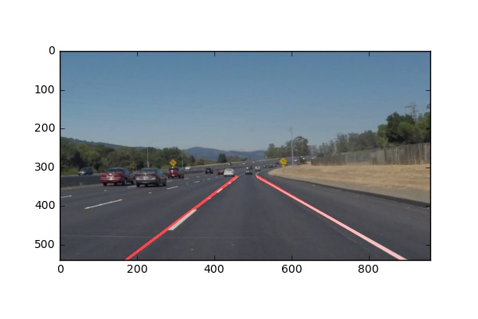

# SDC-P1
Udacity SDC Project 1: Finding Lane Lines on the Road

SDC-P1 is a program written in Python to identify lane lines on the road in either images or videos.



The majority of its software is based on the Open Source Computer Vision Library (OpenCV).  OpenCV is an open source computer vision and machine learning software library. OpenCV was built to provide a common infrastructure for computer vision applications and to accelerate the use of machine perception in the commercial products.  More about OpenCV can be found at http://opencv.org/.

## Installation

This project uses python 3.5.2.  Clone the GitHub repository and use Pip to install jupyter and other dependencies listed, if not already done.

```
$ git clone https://github.com/diyjac/titanic_survival_exploration.git
$ pip install jupyter
$ pip install matplotlib
$ pip install numpy
$ pip install cv2
$ pip install moviepy
```

## Usage

SDC-P1 project results can be viewed by opening its jupyter notebook.

```
$ jupyter notebook P1.ipynb
```

## Contributing

No further updates nor contributions are requested.  This project is static.

## License

SDC-P1 results are released under the [MIT License](./LICENSE)
